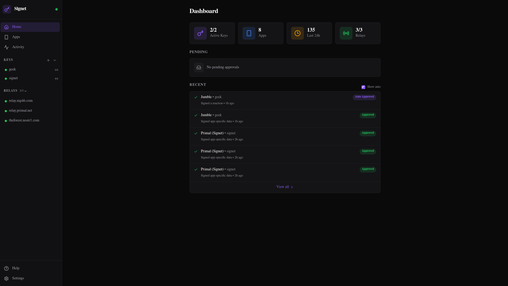

# Signet

A modern NIP-46 remote signer for Nostr. Manages multiple keys securely with a web dashboard for administration. This project was originally forked from [nsecbunkerd](https://github.com/kind-0/nsecbunkerd), but has since received an extensive rewrite and now shares very little code with it.

Signet separates the signing back end from the front end, and ships with a web UI. A companion Android app is [available on ZapStore](https://zapstore.dev/apps/naddr1qvzqqqr7pvpzpk4yr0kmdpv3xcalgsrldp7tj7yuc4p76qjtka7z95kgfky02s2nqq2hgetrdqhxwet9dd6x7umgdyh8x6t8dejhgck8a3z). Other platforms are possible and on the roadmap.

## Web UI Screenshots

<p align="center">
  
  
</p>

## Android Screenshots

<p align="center">
  
  
  
</p>

## Quick Start (Docker)

```bash
git clone https://github.com/Letdown2491/signet
cd signet
pnpm install
# If you plan to run the daemon with the web dashboard
docker compose up --build
# Or if you plan to run the daemon with the Android app
docker compose up --build signet
```

- Daemon + REST API will run on `http://localhost:3000`
- Web dashboard will run on `http://localhost:4174`. The web dashboard is not required if you plan to manage Signet using the Android app.

The daemon displays your local network IP address on startup. If a single IP is detected, it also shows a QR code you can scan with the Android app for quick setup.

If you prefer to add keys directly through the CLI:

```bash
docker compose run --rm signet add --name main-key
```

**Upgrading:** Pull the latest changes, rebuild, and restart. Database migrations run automatically on daemon startup.

## Quick Start (PNPM)

Build and run the daemon:

```bash
cd apps/signet
pnpm run build
pnpm run prisma:migrate
pnpm run lfg
```

For long-running deployments, use a process supervisor (systemd, PM2, etc.) to ensure automatic restarts on crash. See [docs/DEPLOYMENT.md](docs/DEPLOYMENT.md) for examples.

Build and run the UI (in a separate terminal):

```bash
cd apps/signet-ui
pnpm run build
pnpm run start
```

Or from the monorepo root:

```bash
pnpm run build:daemon && pnpm run build:ui
pnpm run start:daemon  # terminal 1
pnpm run start:ui      # terminal 2
```

The UI server proxies API requests to the daemon, so you only need to expose port 4174. See [docs/DEPLOYMENT.md](docs/DEPLOYMENT.md) for remote access configuration.

**Upgrading:** Pull the latest changes, rebuild, and restart. Database migrations run automatically on daemon startup.

## Configuration

Config is auto-generated on first boot at `~/.signet-config/signet.json`.

See [docs/CONFIGURATION.md](docs/CONFIGURATION.md) for all options.

## Connecting Apps

There are two ways to connect a Nostr app to Signet:

**bunker:// (Signet initiates)**
1. Go to the Keys page and select a key
2. Click "Generate bunker URI" to get a one-time connection link
3. Paste the bunker URI into your Nostr app's remote signer settings
4. The app connects automatically

**nostrconnect:// (App initiates)**
1. In your Nostr app, look for "Connect via remote signer" or similar
2. The app displays a nostrconnect:// URI or QR code
3. In Signet, click + on the Apps page (or scan QR on Android)
4. Paste the nostrconnect:// URI and choose a key and trust level
5. Click Connect to complete the handshake

Both methods result in the same secure connection. Use whichever your app supports.

## Security

Keys are encrypted with NIP-49 (XChaCha20-Poly1305 with scrypt, recommended) or legacy AES-256-GCM. API endpoints require JWT auth with CORS and rate limiting. An optional **Inactivity Lock** (Dead Man's Switch) automatically locks all keys and suspends all apps if not reset within a configurable timeframe. Additional, an optional admin npub can be set to allow sending DM commands (NIP-04/NIP-17) to Signet without access to any UI.

DO NOT run the daemon on a public machine. We recommend private network access only. Tailscale is preferred and documented in [docs/DEPLOYMENT.md](docs/DEPLOYMENT.md). 

See [docs/SECURITY.md](docs/SECURITY.md) for the full security model.

## Documentation

- [Configuration Reference](docs/CONFIGURATION.md) - All config options
- [Deployment Guide](docs/DEPLOYMENT.md) - Tailscale, reverse proxies, etc.
- [Security Model](docs/SECURITY.md) - Security architecture and threat model
- [Kill Switch Guide](docs/KILLSWITCH.md) - Emergency remote control via Nostr DMs
- [API Reference](docs/API.md) - REST API endpoints
- [Android App](docs/ANDROID.md) - Setup and building the mobile app
